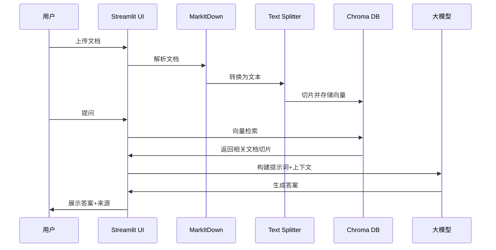

# RAG Demo

一个功能完整的 RAG（检索增强生成）智能问答系统演示项目，支持多种文档格式的上传、智能切片、向量存储和基于上下文的问答。

## ✨ 功能特性

- 📄 **多格式文档支持**：支持 PDF、Word、Excel、PPT、Markdown、文本等多种文档格式
- ✂️ **智能文档切片**：使用 LangChain 的 RecursiveCharacterTextSplitter 进行智能文档切片，保证上下文连贯性
- 🗄️ **向量存储**：使用 Chroma 向量数据库进行持久化存储和高效检索
- 🤖 **智能问答**：基于检索到的相关文档内容，使用大模型生成准确的答案
- 🎨 **友好界面**：基于 Streamlit 构建的现代化 Web 界面，操作简单直观
- 📊 **可视化展示**：显示检索来源、相似度评分、文档统计等详细信息

## 🏗️ 技术架构



## 🛠️ 技术栈

- **[Streamlit](https://streamlit.io/)** - 前端框架，负责用户交互和展示
- **[MarkItDown](https://github.com/microsoft/markitdown)** - 文档解析，将各种格式转换为 Markdown
- **[LangChain Text Splitters](https://python.langchain.com/docs/modules/data_connection/document_transformers/)** - 智能文档切片
- **[Chroma](https://github.com/chroma-core/chroma)** - 向量数据库，负责文档的嵌入、存储和检索
- **大模型 API** - 使用兼容 OpenAI 的 API 接口（推荐使用 [白山大模型API](https://ai.baishan.com/auth/login?referralCode=ttXv0P1zRH)，使用邀请码 `ttXv0P1zRH` 注册即送 150 元）

## 🚀 快速开始

### 1. 环境准备

```bash
# 克隆项目
git clone <repository-url>
cd rag-demo

uv sync
source .venv/bin/activate
```

### 2. 配置环境变量(可选)

创建 `.env` 文件并配置 API 密钥：

```bash
OPENAI_BASE_URL=https://your-api-endpoint
OPENAI_API_KEY=your-api-key-here
```
未设置需要在页面上手动输入

### 3. 运行应用

```bash
streamlit run app.py
```

应用将在浏览器中自动打开，默认地址为 `http://localhost:8501`

## 📖 使用指南

### 上传文档

1. 在左侧边栏点击"上传文档"
2. 选择一个或多个文档文件（支持 PDF、DOCX、PPTX、XLSX、TXT、MD）
3. 系统会自动解析、切片并存储文档

### 提问

1. 在底部输入框中输入您的问题
2. 系统会自动检索相关文档并生成答案
3. 点击"参考来源"可以查看答案所依据的文档片段

### 参数调整

在左侧边栏可以调整：
- **模型选择**：选择不同的大模型
- **检索文档数量**：控制每次检索返回的文档切片数量（1-20）

### 数据管理

- 查看数据库统计信息（文档切片数量）
- 清空数据库（需要二次确认）
- 开启调试模式查看详细信息

## 🔧 核心功能说明

### 文档切片策略

使用 `RecursiveCharacterTextSplitter` 进行智能切片：
- **切片大小**：1000 字符
- **重叠区域**：200 字符（保证上下文连贯性）
- **优先分隔符**：按段落、句子、标点符号的顺序进行切分

### 向量检索

- 使用 Chroma 内置的嵌入模型自动处理向量化
- 支持相似度搜索，返回最相关的文档切片
- 每个切片包含元数据：文档来源、切片索引、总切片数

### 答案生成

- 基于检索到的文档构建上下文
- 使用系统提示词引导模型基于文档回答
- 支持追溯答案来源和查看原始文档内容

## 📁 项目结构

```
rag-demo/
├── app.py              # 主应用程序
├── pyproject.toml      # 项目配置和依赖
├── .env                # 环境变量配置
├── .gitignore          # Git 忽略文件
├── README.md           # 项目文档
```
